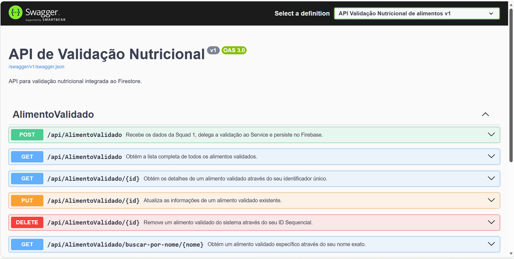

# NutriFoodAPI — Módulo de Validação Nutricional
---
<div align="center">
  
</div>

---

Esta Web API foi desenvolvida em **ASP.NET Core** com o objetivo de centralizar a ingestão, validação de regras de negócio e a persistência de dados nutricionais coletados de APIs externas. O microsserviço atua de forma integrada com outras frentes de desenvolvimento (Squads), assegurando a qualidade e a rastreabilidade das informações antes de consolidadas no banco de dados Cloud Firestore.

---

## 🛠️ Stack Técnica e Arquitetura

* **Runtime:** .NET Core 6.0 / 7.0 / 8.0 (conforme configuração da aplicação)
* **Linguagem:** C# (Programação Assíncrona via `async/await`)
* **Persistência de Dados:** Google Cloud Firestore (NoSQL)
* **Monitorização:** Camada nativa de Log (`ILogger`) para rastreabilidade estruturada.
* **Documentação e Testes:** Swagger UI (OpenAPI v3).

---

## 🚀 Instruções para Execução e Configuração

### 1. Pré-requisitos
Antes de iniciar, certifique-se de que possui as seguintes ferramentas instaladas na sua máquina:
* [.NET SDK](https://dotnet.microsoft.com/download) (Versão correspondente ao projeto)
* [Git](https://git-scm.com)

### 2. Configuração de Credenciais do Google Firebase
Como o projeto utiliza o **Google Cloud Firestore**, é obrigatório fornecer o ficheiro de chaves do setor de IAM para autenticação:
1. Faça o download do ficheiro JSON de credenciais (`service-account.json`) a partir do Console do Firebase.
2. Adicione o ficheiro na raiz do projeto ou configure uma variável de ambiente no seu sistema operativo:
   ```bash
   # Windows (PowerShell)
   $env:GOOGLE_APPLICATION_CREDENTIALS="C:\caminho\para\seu\service-account.json"

   # Linux/macOS
   export GOOGLE_APPLICATION_CREDENTIALS="/caminho/para/seu/service-account.json"
### 3. Executar a Aplicação Localmente

Navegue até a pasta raiz do projeto onde se encontra o ficheiro `.csproj` através do terminal e execute os comandos:

```bash
# 1. Restaurar as dependências do NuGet
dotnet restore

# 2. Compilar a aplicação
dotnet build

# 3. Executar a API em modo de Desenvolvimento
dotnet run
```
O terminal exibirá os endereços locais em que a API está à escuta. 

**Exemplos:**
* `https://localhost:7001`
* `http://localhost:5001`

> 💡 **Nota:** Certifique-se de usar o protocolo correto (`http` ou `https`) ao realizar as requisições para a API.

---
 ## 🌐 Documentação dos Endpoints (Contrato da API)

**Classe Controladora:** `AlimentoValidadoController`  
**Rota base:** `/api/AlimentoValidado`

---

### 1. Criar e Validar Alimento

* **Método:** `POST`
* **Rota:** `/api/AlimentoValidado`
* **Descrição:** Recebe um alimento enviado pela Squad de origem, consulta a API Nutricional Externa (API-Ninjas), efetua a fusão com as regras internas e persiste no Firestore gerando um ID sequencial seguro.

**Corpo da Requisição (JSON):**

```json
{
  "name": "Banana"
}
```
### 📋 Códigos de Resposta

| Código | Status | Descrição |
| :--- | :--- | :--- |
| **201** | `Created` | Processado e guardado com sucesso. |
| **400** | `Bad Request` | Dados inválidos ou nome do alimento vazio. |
| **404** | `Not Found` | Alimento não encontrado na base nutricional externa. |
| **502** | `Bad Gateway` | API externa indisponível ou fora do ar. |
| **500** | `Internal Server Error` | Falha crítica de comunicação com o Firestore. |

### 2. Obter Todos os Alimentos Validados

* **Método:** `GET`
* **Rota:** `https://apinutrifood.runasp.net/api/AlimentoValidado`
* **Descrição:** Retorna a listagem completa de todos os registos persistidos no histórico do Firestore.

#### Códigos de Resposta

| Código | Status | Descrição |
| :--- | :--- | :--- |
| **200** | `OK` | Lista obtida com sucesso (retorna um array de objetos ou vazio `[]`). |
| **500** | `Internal Server Error` | Erro no servidor ao aceder ao banco de dados. |

### 3. Obter Alimento por ID Sequencial

* **Método:** `GETBYID`
* **Rota:** `https://apinutrifood.runasp.net/api/AlimentoValidado/{id}`
* **Descrição:** Efetua uma busca direta utilizando o Identificador Sequencial guardado.

#### Códigos de Resposta

| Código | Status | Descrição |
| :--- | :--- | :--- |
| **200** | `OK` | Registo localizado com sucesso. |
| **404** | `Not Found` | ID informado não existe no sistema. |

### 4. Filtrar Alimentos por Nome

* **Método:** `GET`
* **Rota:** `https://apinutrifood.runasp.net/api/AlimentoValidado/buscar-por-nome/{nome}`
* **Descrição:** Realiza uma pesquisa baseada em termos/palavras-chave na base de dados (remove espaços em branco automaticamente através do método `.Trim()`).

#### Códigos de Resposta

| Código | Status | Descrição |
| :--- | :--- | :--- |
| **200** | `OK` | Retorna os registos que correspondem ao critério. |
| **400** | `Bad Request` | Parâmetro de busca vazio. |
| **404** | `Not Found` | Nenhuma correspondência localizada no histórico. |

### 5. Atualizar Alimento Existente

* **Método:** `PUT`
* **Rota:** `https://apinutrifood.runasp.net/api/AlimentoValidado/{id}`
* **Descrição:** Substitui na íntegra as informações do documento associado ao ID indicado na URL.

#### Códigos de Resposta

| Código | Status | Descrição |
| :--- | :--- | :--- |
| **200** | `OK` | Atualização consolidada. |
| **400** | `Bad Request` | Divergência entre o ID fornecido na URL e o ID interno do corpo JSON. |
| **404** | `Not Found` | Documento inexistente na base de dados. |

### 6. Remover Alimento do Sistema

* **Método:** `DELETE`
* **Rota:** `https://apinutrifood.runasp.net/api/AlimentoValidado/{id}`
* **Descrição:** Elimina em definitivo o documento correspondente ao ID sequencial informado.
  
#### Códigos de Resposta

| Status Code | Significado | Descrição / Cenário |
| :--- | :--- | :--- |
| **200** | OK | Remoção concluída com sucesso. |
| **400** | Bad Request | ID inválido ou nulo. |
| **404** | Not Found | Identificador não encontrado para exclusão. |

---
## 🛡️ Rastreabilidade e Resiliência (Logs)

A controladora possui tratamento completo de exceções estruturado (`try-catch`), interagindo diretamente com a interface `ILogger`. Isto garante que:

* **Detecção de Anomalias:** Tentativas de fraude ou envio de dados malformados geram alertas de aviso (`LogWarning`).
* **Blindagem de Erros:** Falhas de rede externas e indisponibilidade de serviços terceiros geram logs de erro específicos (`LogError`), impedindo que o utilizador visualize mensagens nativas do sistema (*stack traces* confusas).

  ## 📝 Swagger UI: Documentação Interativa

O projeto expõe nativamente a documentação através do padrão OpenAPI utilizando a ferramenta Swagger UI. Com a aplicação em execução, pode aceder à página interativa através do endereço:

👉 **Swagger UI:** [(http://apinutrifood.runasp.net/swagger/index.html) *(ou  conforme a porta configurada)*

### Vantagens de utilizar o Swagger UI no projeto:

* **⚡ Testes em Tempo Real (Interactive Playground):** Permite realizar chamadas diretamente nos endpoints HTTP (`POST`, `GET`, `PUT`, `DELETE`) sem a necessidade de instalar ferramentas externas como o Postman ou Insomnia.
* **📜 Garantia de Contrato Único:** Os códigos de estado documentados (201, 400, 404, 502, 500) e os tipos de dados aceites são exibidos visualmente de forma clara para as outras equipas (Squads).
* **🔄 Documentação Viva:** Qualquer alteração efetuada nos comentários XML da `AlimentoValidadoController` reflete-se automaticamente na interface visual na próxima compilação, prevenindo documentações desatualizadas em ficheiros externos de texto.
